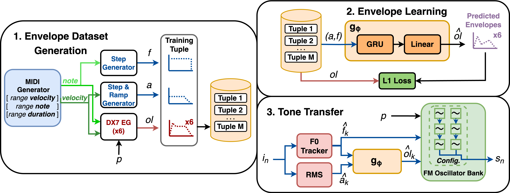

<h1 align="center">FM Tone Transfer with Envelope Learning</h1>
<div align="center">
<h3>
    <a href="https://fcaspe.github.io/assets/pdf/learned_envelopes.pdf" target="_blank">paper</a> - <a href="https://fcaspe.github.io/fmtransfer" target="_blank">website</a>
</h3>
    <p>
    Franco Caspe - Andrew McPherson - Mark Sandler
    </p>
</div>

<center>

</center>

This is the official implementation of the FM Tone Transfer with Envelope Learning paper, accepted to [Audio Mostly 2023](https://audiomostly.com/2023/).

## Install

To install with development dependencies:

```bash
$ pip install -e ".[dev]"
```

Install pre-commit hooks if developing and contributing:

```bach
$ pre-commit install
```

## Run

Code in this repo is accessed through the PyTorch Lightning CLI, which is available through the `fmtransfer` console script. To see help:

```bash
$ fmtransfer --help
```

To run an experiment, pass the appropriate config file to the `fit` subcommand. For example:

```bash
$ fmtransfer fit -c cfg/paper_runs.yaml
```

To replicate the paper's results, please run:

```bash
$ source schedule/test/paper_runs.sh
```

 ## Citation
 If you find this work useful, please consider citing us:

```bibtex
@article{caspe2023envelopelearning,
    title={{FM Tone Transfer with Envelope Learning}},
    author={Caspe, Franco and McPherson, Andrew and Sandler, Mark},
    journal={Proceedings of Audio Mostly 2023},
    year={2023}
}
```